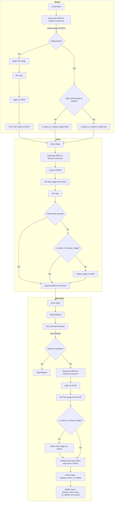

### main.yml

```mermaid
flowchart TD
 subgraph s1["<b>BUILD</b>"]
        n2["Clone Repo"]
        C["Downcase REPO & Shorten Commit ID"]
        D{"Image Exists?"}
        E["is_latest_or_release_image=false"]
        F["Build Test Image"]
        G["Run App"]
        H["Login to GHCR"]
        I["Push Test Image to GHCR"]
        n3["Tags contain latest or release?"]
        n4["is_latest_or_release_image=true"]
  end
 subgraph s2["<b>TEST</b>"]
        J["Clone Repo"]
        K["Downcase REPO & Shorten Commit ID"]
        L["Login to GHCR"]
        M["Pull Test Image from GHCR"]
        N["Run App"]
        O["Robot Tests Succeed"]
        R["Upload Artifacts Test Result"]
        n5["is_latest_or_release_image?"]
        n6["Delete image in GHCR"]
  end
 subgraph s3["<b>RELEASE</b>"]
        S["Clone Repo"]
        T["Setup Node.js"]
        U["Run Semantic Release"]
        V{"Release Published?"}
        W["Skip Release"]
        X["Downcase REPO & Shorten Commit ID"]
        Y["Login to GHCR"]
        Z["Pull Test Image from GHCR"]
        AA{"is_latest_or_release_image?"}
        AB["Delete Test Image On GHCR"]
        n8["Change local tag to latest and push to GHCR"]
        n9["Clone charts, stacked_charts, CI_Utilities"]
        n10["Modify charts, stacked_charts using CI_Utilities and commit"]
  end
    C -- Check Image in GHCR --> D
    D -- Yes --> n3
    D -- No --> F
    F --> G
    G --> H
    H --> I
    I --> J
    J --> K
    K --> L
    L --> M
    M --> N
    N --> O
    R --> S
    S --> T
    T --> U
    U -- New Release --> V
    V -- No --> W
    V -- Yes --> X
    X --> Y
    Y --> Z
    Z --> AA
    AA -- No --> AB
    n2 --> C
    n3 -- No --> E
    n3 -- Yes --> n4
    E --> J
    n4 --> J
    O -- Yes --> R
    n5 -- No --> n6
    n5 -- Yes --> R
    O -- No --> n5
    n6 --> R
    AB --> n8
    AA -- Yes --> n8
    n8 --> n9
    n9 --> n10

    n3@{ shape: diam}
    O@{ shape: diam}
    n5@{ shape: diam}
```

